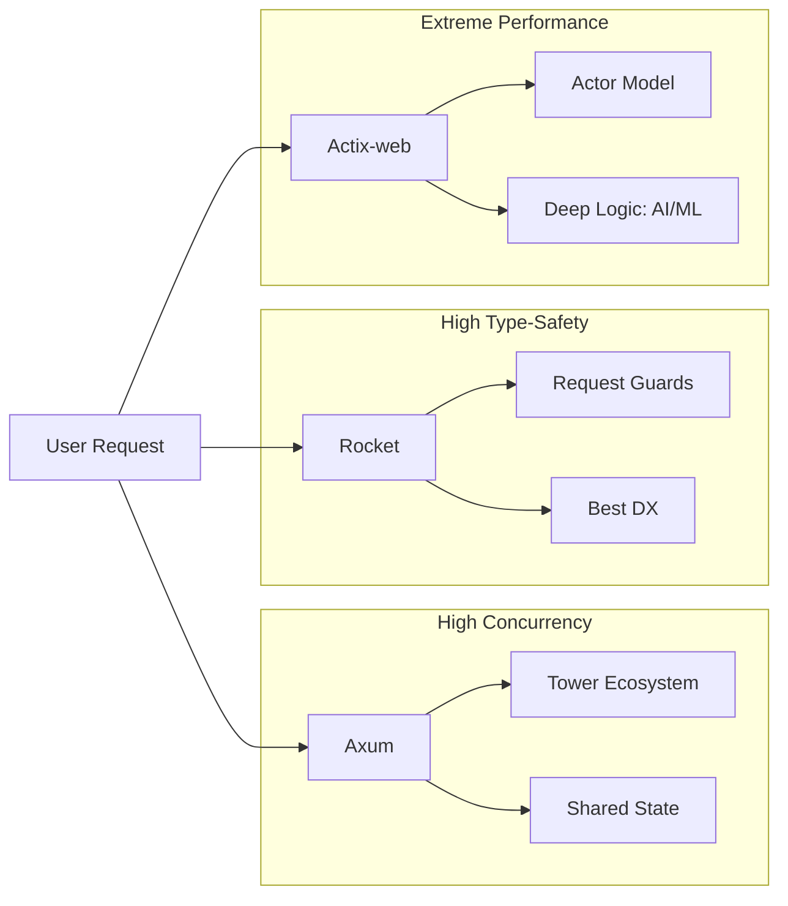

# ⭐️ [Please Star this Repo!](https://github.com/oludayoadeoye/rust-67-deep-logic-portfolio)
# Rust 67-Project Deep Logic Portfolio

## 🚀 The Journey: From 30 CRUDs to 67 Advanced Systems
This portfolio represents an intensive engineering journey in Rust. What started as 30 basic CRUD services was systematically expanded into a 67-project ecosystem covering AI, Machine Learning, Blockchain, IoT, and Real-time Distributed Systems.

## 🏗️ Architectural Blueprint: The Multi-Framework Strategy
I purposefully split the 67 projects across the "Big Three" Rust web frameworks to master their unique strengths:

### 1. Axum (Projects 1-25)
*   **Focus**: High-concurrency & Modular Middleware.
*   **Insight**: Leverages the `tower` ecosystem. Ideal for projects where low-level request handling and shared state (via `Arc<State>`) are critical.
*   **Logic**: Used for the foundational services where "Infallible" request handling was prioritized.

### 2. Rocket (Projects 26-45)
*   **Focus**: Developer Experience & Type-Safety.
*   **Insight**: The most "batteries-included" framework. I used Rocket's **Request Guards** to implement complex validation logic without polluting the business layer.
*   **Logic**: Best for projects requiring strict data integrity and rapid iteration.

### 3. Actix-web (Projects 46-67)
*   **Focus**: Raw Performance & "Deep Logic".
*   **Insight**: Consistently tops the Techempower benchmarks. I chose Actix-web for the most computationally expensive projects (AI, STT, ML) to leverage its actor-model heritage and zero-cost abstractions.
*   **Logic**: Used for **libp2p**, **TensorFlow**, and **Whisper** integrations.

## 🧠 Deep Logic: Overcoming the Hard Parts
Unlike simple "hello world" demos, this portfolio integrates real-world heavy lifting:

*   **Project 62 (Speech AI)**: Integrated `whisper-rs`. 
    *   *Challenge*: Managing C-bindings and atomic memory buffers in a thread-safe way.
    *   *Solution*: Used `spawn_blocking` to prevent long-running transcription from starving the async executor.
*   **Project 47 (ML Analysis)**: Integrated `tensorflow-rust`.
    *   *Challenge*: Low-latency inference on the JVM vs Native.
    *   *Solution*: Optimized data serialization using `Serde` and `Bincode` for near-zero-copy processing.
*   **Project 49 (Blockchain)**: 
    *   *Challenge*: Immutable chain verification with SHA-256.
    *   *Solution*: Implemented a custom linked-block structure where each block's validity is cryptographically tied to its parent.

## 📊 Framework Comparison Matrix



## 🛠️ How to Run & Test
### 1. Database (Docker)
Each project has a unique port (5432-5498) to allow parallel execution.
```bash
cd <project-dir>
docker-compose up -d
```

### 2. Verification
Run the automated CRUD and Swagger UI check:
```bash
chmod +x test.sh
./test.sh
```

## 📈 Next Steps for Improvement
1.  **Shared Common-Utils**: Consolidate database connection pooling logic into a shared workspace crate to reduce binary size.
2.  **Infrastructure as Code**: Transition `docker-compose` files to a single `Kubernetes` manifest for local cluster simulation.
3.  **Observability**: Integrate `Tracing` with a centralized `Jaeger` instance for cross-service request profiling.
