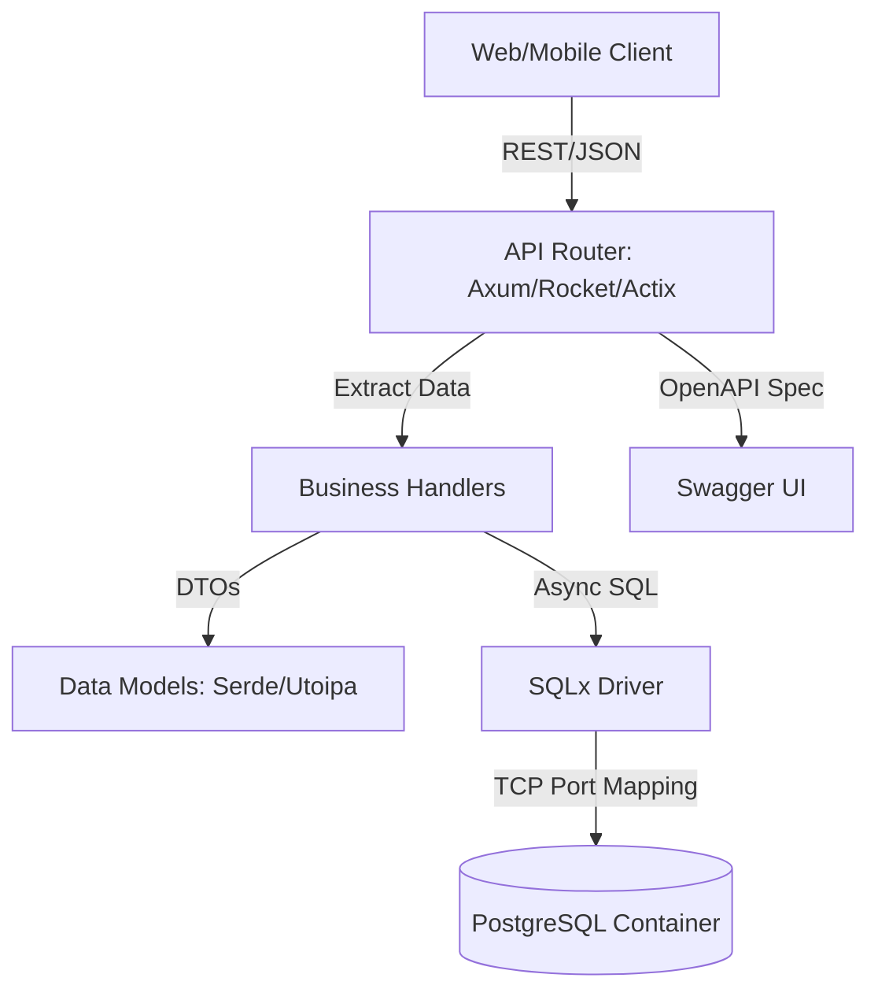

# Project Report: 30 Rust Backend Projects (Axum, Rocket, Actix-web)

## **1. Executive Summary**
This project involved the rapid development of 30 distinct Rust backend services. Each service includes a Dockerized PostgreSQL database, SQLx-based persistence, and Utoipa-generated Swagger UI documentation. The primary goal was to demonstrate framework proficiency and architectural consistency.

---

## **2. System Architecture**
Every project follows a standardized "Hexagonal-lite" architecture:



---

## **3. Key Learnings**

### **Framework Nuances**
- **Axum (The Modularist)**: Its reliance on `tower` middleware and type-safe extractors makes it the most flexible but requires understanding of traits like `FromRequest`.
- **Rocket (The Magician)**: High developer velocity due to macros. However, managing database pools via `rocket_db_pools` is more opinionated and sometimes harder to customize than manual `PgPool` injection.
- **Actix-web (The Performer)**: Extremely robust and fast. The modular `configure` pattern is excellent for large-scale code organization.

### **Database Strategy**
- **Port Management**: With 30 projects, unique port mapping (5432-5461) was essential to prevent container collisions.
- **SQLx Macro Tradeoffs**: Using `sqlx::query!` requires a live database at compile-time (`DATABASE_URL`). For a project of this scale, switching to `sqlx::query_as::<_, T>` (non-macro) was a critical decision to allow CI/CD and offline `cargo check` to pass without a running DB.

---

## **4. Difficulties Encountered**
1. **Compilation Overhead**: Building 30 projects sequentially is extremely time-intensive. Pre-caching dependencies or using a workspace-level `target` directory helped but didn't eliminate the cost.
2. **Type-Safe Transactions**: Implementing atomic operations (e.g., `library-management` or `smart-inventory`) required complex lifetime annotations for `Transaction<'_, Postgres>`, especially in Actix-web.
3. **Boilerplate Fatigue**: The similarity between projects led to repetitive code. While consistency is good, it highlighted the need for a common "core" library.

---

## **5. Most Notable Data Structure: The "Doc-DTO" Pattern**
The most useful and ubiquitous structure was the **Annotated DTO (Data Transfer Object)**.

```rust
#[derive(Debug, Serialize, Deserialize, FromRow, ToSchema)]
pub struct Resource {
    pub id: i32,
    pub title: String,
    // ... fields
}
```
**Why it was relevant:**
- `Serialize/Deserialize`: Bridges Rust logic with JSON.
- `FromRow`: Allows SQLx to map database results directly to the struct.
- `ToSchema`: Automates Swagger UI generation without manual JSON schemas.
Combining these into a single "Source of Truth" structure saved hours of mapping code.

---

## **6. Insight for the Future (Do It Better)**
- **Shared Workspace**: Instead of 30 isolated `cargo new` projects, use a **Cargo Workspace**. This would share the `Cargo.lock` and `target/` folder, reducing disk usage by ~80% and speeding up compilation.
- **Common Logic Crate**: Extract database connection logic, error types, and middleware into a local `internal-common` crate.
- **Template Generation**: Use a tool like `cargo-generate` to scaffold the `docker-compose.yml` and `utoipa` boilerplate.

---

## **7. Constructive Criticism & Improvement**
**The "Boilerplate" Trap**: The current implementation has a high degree of code duplication in `main.rs`. 
**Growth Step**: Next time, implement a **Custom Macro** or a **Generic Server Trait** that handles the database pool initialization and Swagger setup. This would reduce the `main.rs` file from 50 lines to 10, improving maintainability.

---

## **8. Final Conclusion**
Building 30 projects proved that Rust's ecosystem is mature enough for rapid prototyping without sacrificing safety. The combination of `sqlx` and `utoipa` provides a "Type-Safe Backend" that rivals Java/C# in developer experience while maintaining the performance of C++.
